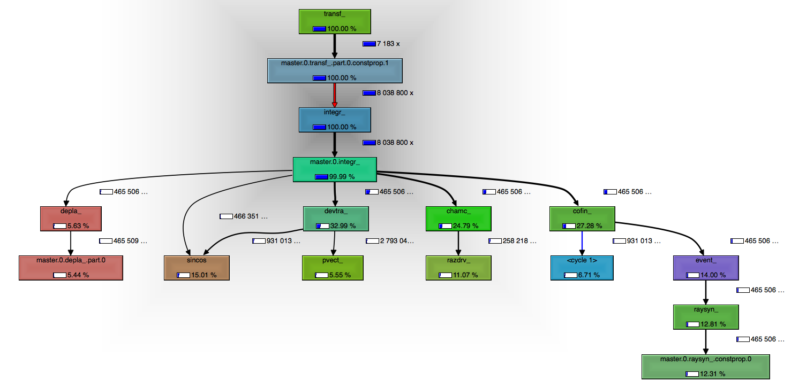
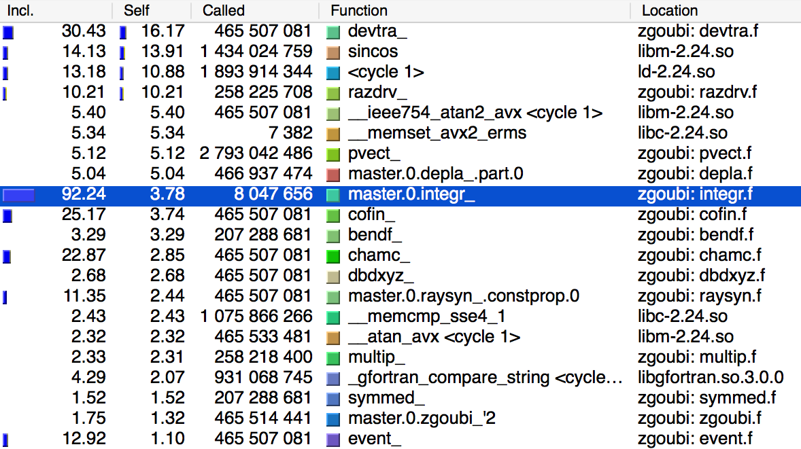
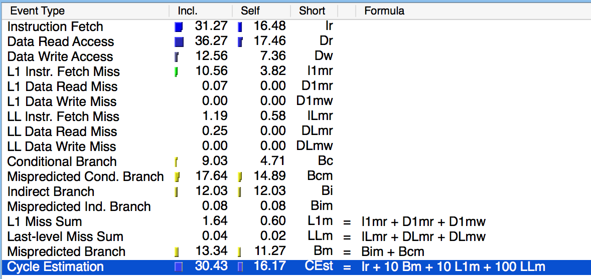

# zgoubi profiling results for `SRDampingInESRFRing-coupled`

## Introduction

In order to improve zgoubi's execution time, we profiled the `SRDampingInESRFRing-coupled` example with a variety of parameters. The goal is to identify major bottlenecks in the application and to ensure that the bottlenecks remain, even under different computational loads.

## Methods

### Input Data

Based of the `SRDampingInESRFRing-coupled` we [generated](../../examples/SRDampingInESRFRing/coupled_template), 9 input files (`zgoubi.dat`) where we varied the number of turns (1, 6, 11) and particles (100, 600, 1100).

### Execution Profiling

To gather information about the execution we used [Valgrind](http://www.valgrind.org), with cache and branch analysis enabled. The commandline to invoke Valgrind with these setting is:

```sh
valgrind --tool=callgrind --cache-sim=yes --branch-sim=yes zgoubi
```

Since Valgrind is a virtual execution environment, it does not achieve native execution speed of the application. We have observed slowdowns of more than 70x; so in order to make the profiling feasible it is only possible to execute examples with restricted run times.

### Execution environment

All the necessary code has been packed in a Docker based [environment](../../container-conf). In order to run the experiment we executed the following:

```sh
docker pull radiasoft/rszgoubi
./examples/SRDampingInESRFRing/coupled_template/gen_template.sh
./bin/run_in_docker.sh $(realpath ./examples/SRDampingInESRFRing/coupled_template) /tmp/run-2017-03-17T22_17_00+00_00 valgrind --tool=callgrind --cache-sim=yes --branch-sim=yes zgoubi

```

## Results

Valgrind results were analyzed using [`KCachegrind`](https://kcachegrind.github.io/html/Home.html). `KCachegrind`, which provides visualization of execution stacks and execution, branching, and caching costs.

The figure below contains a tree based visualization of the call tree; for sake of brevity only the most expensive functions are shown, the rest are collapsed within the nodes of the tree. The tree offers a caller-callee relationship between functions and also the cumulative (self execution + children execution) percentage of time spent in each function.



From the previous graph we can see a some of the functions that could be likely candidates for optimization due to their cumulative costs. It is important to distinguish between the individual execution costs versus the cumulative execution costs (which include execution costs of other functions). The best candidates will have a high cumulative cost and high individual cost.

In the table below we see a list of all the functions used in zgoubi, listed by individual execution cost (*Self*). It is of note that *devtra* has a relatively high cumulative and individual execution cost. Another function with a high is cost is `sincos`.



### `devtra`

Execution costs (termed *Cycle Costs* by Valgrind) can be broken down into several metrics. Below is a table with the full metrics collected for *devtra*. Some costs in the list are unavoidable, e.g. *Instruction Fetch*. But others could be minimized if the program structure is improved, for example, we can see in the table that *Mispredicted Cond. Branch* (Bcm) and *Indirect Branch* (Bi) have a high execution cost. 



If we inspect [`devtra.f`](https://github.com/radiasoft/zgoubi/blob/3d77b37a33a02050a15a29e57166a5d03f55f90c/zgoubi/devtra.f#L130), we can see that the subroutine uses many loops, some of the them are nested and within the loops there is conditional branching:

```fortran
CALCUL B''=d2B/ds2
      KIJM = -IJMAX-IMAX
      KIM = -IMAX
      DO 15 K=1,3                                         <<<<< Loop
        TP=0.D0
        IF(IDB.GE.1) THEN                                 <<<<< Nested conditional
          KIJM = KIJM + IJMAX
          KIM = KIM + IMAX
          DO 14 I=1,3                                     <<<<< Nested loop
            IK = I + KIM
            TP=TP+U(2,I)*DB(IK)
C
C           symetrie
C
            IF(IDB.GE.2) THEN                             <<<<< Nested conditional
              IKIJ = I + KIJM
              DO 141 J=I,3                                <<<<< Nested loop
                IF(I .EQ. J) THEN                         <<<<< Nested conditional
                  XMUL=1.0D0
                ELSE
                  XMUL=2.0D0
                ENDIF
                IJK = IKIJ + J*IMAX
                TP=TP+XMUL*U(1,I)*U(1,J)*DDB(IJK)
 141          CONTINUE
            ENDIF
 14       CONTINUE
        ENDIF
        B(3,K)=TP
 15   CONTINUE
```

Branching can severely affect the performance of [superscalar processors](https://en.wikipedia.org/wiki/Superscalar_processor), and conditional operations and loops use branching heavily at the processor level.

To avoid these issues processors and compilers have built in several features that allow improving branching performance:

* Branch prediction: processors keep statistics of execution so that a branch target can be predicted and the right source of data is continously loaded in the processor, to avoid pipeline stalls. These statistics are very shallow, so if we have many branching operations (e.g. nested loops with nested conditionals), the predictor will not be effective. A solution is to use loop unrolling, avoid nesting loops and conditionals within another loop.

* Vectorization: compilers can also transform operations written in scalar form to leverage vector operations within the processor that are much faster. Writing code that can be effectively vectorized can be a bit of black magic, but in general it requires simplifying the algorithm so that the compiler can recognize that the optimization can be applied. Costs related to *Data Read Access* or *Data Write Access* can be lessened with proper optimization.

### `sincos`

Operations like `sincos` that are implemented outside zgoubi also have a very high execution cost on the application. If the trigonometric function could be reimplemented such that some accuracy could be traded for speed, while maintaing the results within an acceptable range of accuracy, then additional gains could be obtained.

## Discussion

We have analyzed the profiling results, in particular the call with the highest execution cost. Valgrind has shown that there are inefficiencies in the code and given us clues as what they could be. By analyzing the source code and looking at the structure trying to identify where those inneficiences could be we have an idea of that direction we need to take.

Overall, while there are a few functions that concentrate more of the execution costs, the vast majority of the costs are scattered accross the entire application. And from the results we can see that some of the costs are due to inefficiencies in how the code is leveraging processor features.

A sensible approach to improve execution speed would be to refactor the code, starting with the functions that have the highests costs and reorganzing the code so that processor features that can be improve execution speeds can be leveraged, for example:

* Loop unrolling.
* Avoid inner loops.
* Avoid branching operations inside loops.
* Ensure variables are properly aligned in memory.
* Reorganize the code such that the compiler can try to vectorize some of the operations.

Another way to get more information about optimization issues with the code is passing `-fopt-info-missed=missed.txt` flag to `gfortran` in the `Makefile`. When the compilation is done a file `missed.txt` will be generated with information of places in the code where the compiler was unable to apply an optimization.
